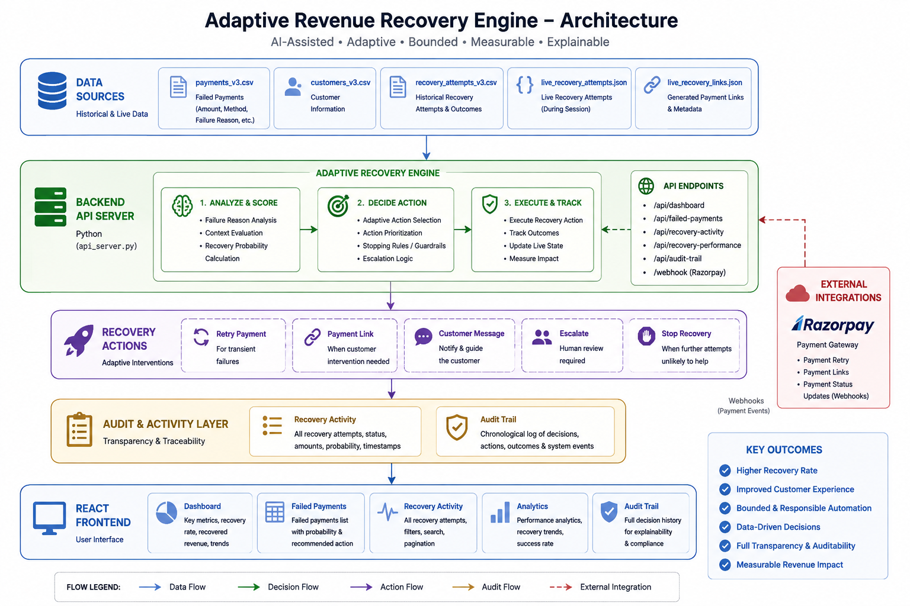

# Adaptive Revenue Recovery Engine

> An adaptive payment recovery system that identifies failed payments, estimates recovery probability, selects appropriate recovery actions, applies bounded recovery workflows, and maintains an audit trail.

Built for the Razorpay AI Buildathon — AI Revenue Recovery Track.

---

## Problem

Failed payments directly impact business revenue. However, not every failed payment should be handled in the same way.

A temporary network failure may succeed after a retry, while an expired card may require customer intervention. Repeated failures should eventually stop instead of endlessly retrying.

Static recovery workflows often lead to:

- Unnecessary retry attempts
- Poor customer experience
- Repeated payment failures
- Lack of transparency
- No clear stopping rules
- Limited visibility into recovery decisions

The challenge is deciding:

- Which payment is worth recovering?
- What recovery action should be taken?
- How likely is recovery to succeed?
- When should automation stop?
- When should a case be escalated?
- How can every decision be audited?

---

# Solution

Adaptive Revenue Recovery Engine connects the complete recovery lifecycle:

```text
Failed Payment
      ↓
Failure Analysis
      ↓
Recovery Probability
      ↓
Adaptive Action Selection
      ├── Retry Payment
      ├── Generate Payment Link
      ├── Send Customer Message
      ├── Escalate
      └── Stop Recovery
      ↓
Recovery Execution
      ↓
Outcome Tracking
      ↓
Audit Trail
```

Instead of treating all failed payments identically, the system evaluates payment context and recommends an appropriate recovery strategy.

---

# Features

## 1. Failed Payment Analysis

The system processes failed payment records and analyzes:

- Payment ID
- Customer ID
- Payment amount
- Payment method
- Failure reason
- Recovery status
- Recommended recovery action

Supported failure categories include:

- `insufficient_balance`
- `network_error`
- `card_declined`
- `bank_timeout`
- `expired_card`
- `limit_exceeded`

---

## 2. Adaptive Recovery Probability

Each failed payment receives a recovery probability based on its failure reason.

Transient failures can receive higher recovery probability, while failures requiring customer intervention can receive lower probability.

This creates the connection:

```text
Failed Payment
      ↓
Failure Reason
      ↓
Recovery Probability
      ↓
Recommended Action
```

---

## 3. Recovery Action Selection

The recovery workflow supports multiple actions:

### Retry

Used for failures that may be temporary.

Examples:

- Network errors
- Bank timeouts

### Payment Link

Used when an alternative payment flow or customer intervention is appropriate.

### Customer Message

Used where customer communication may improve recovery chances.

### Merchant Escalation

Used when automated recovery should not continue without review.

### Stop Recovery

Used when stopping rules indicate further automated attempts should not continue.

---

## 4. Bounded Recovery Workflow

The system supports bounded recovery instead of unlimited retries.

```text
Attempt
   ↓
Recovery Action
   ↓
Outcome
   ↓
Retry / Alternative Action
   ↓
Escalate or Stop
```

This prevents endless automated recovery attempts.

---

## 5. Recovery Activity Tracking

The Recovery Activity page tracks individual recovery attempts.

It displays:

- Payment ID
- Recovery action
- Recovery probability
- Amount
- Recovered amount
- Timestamp
- Status

Supported statuses:

- Recovered
- Pending
- Failed
- Stopped

Filtering is available for:

- Date range
- Status
- Recovery action
- Search query

---

## 6. Recovery Analytics

The application measures recovery performance using metrics such as:

- Total failed payments
- Recovered payments
- Pending recovery
- Recovery rate
- Recovered revenue
- Recovery performance over time

This answers the key question:

> Is the recovery engine actually recovering revenue?

---

## 7. Audit Trail

Recovery decisions and actions are visible through an audit trail.

The workflow can be inspected as:

```text
Payment Failure
      ↓
Recovery Probability
      ↓
Decision
      ↓
Action
      ↓
Outcome
```

This improves explainability and avoids a completely black-box recovery process.

---

# Application Pages

## Dashboard

High-level recovery overview.

Displays:

- Failed payments
- Recovered payments
- Pending recovery
- Recovered revenue
- Recovery rate
- Average recovery probability

---

## Failed Payments

Displays failed payment records and recovery context.

Includes:

- Payment ID
- Customer ID
- Amount
- Payment method
- Failure reason
- Recovery probability
- Recommended action
- Recovery status

---

## Recovery Activity

Displays individual recovery attempts.

Includes:

- Payment ID
- Action
- Probability
- Amount
- Recovered amount
- Time
- Status

Supports search, filtering, date ranges, and pagination.

---

## Analytics

Provides recovery performance insights.

Includes:

- Recovery metrics
- Recovery trends
- Recovered payments
- Recovery rate
- Revenue recovery metrics

---

## Audit Trail

Provides a chronological view of recovery decisions and events.

Useful for understanding:

- Why an action was selected
- Recovery probability
- Recovery workflow events
- Escalations
- Stopping events
- Recovery outcomes

---

# Architecture

```text
                        ┌─────────────────────┐
                        │   Historical Data   │
                        │   payments_v3.csv   │
                        └──────────┬──────────┘
                                   │
                                   ▼
                        ┌─────────────────────┐
                        │ Recovery Engine API │
                        │   Python Backend    │
                        └──────────┬──────────┘
                                   │
             ┌─────────────────────┼─────────────────────┐
             │                     │                     │
             ▼                     ▼                     ▼
      Failed Payments      Recovery Activity       Analytics
             │                     │                     │
             └─────────────────────┼─────────────────────┘
                                   │
                                   ▼
                        ┌─────────────────────┐
                        │    React Frontend   │
                        └─────────────────────┘
```

---

# Project Structure

```text
adaptive-revenue-recovery/
│
├── backend/
│   └── api_server.py
│
├── frontend/
│   ├── src/
│   │   ├── pages/
│   │   │   ├── Dashboard.jsx
│   │   │   ├── FailedPayments.jsx
│   │   │   ├── RecoveryActivity.jsx
│   │   │   ├── Analytics.jsx
│   │   │   └── AuditTrail.jsx
│   │   │
│   │   └── api.js
│   │
│   └── package.json
│
├── data/
│   ├── payments_v3.csv
│   ├── customers_v3.csv
│   ├── recovery_attempts_v3.csv
│   ├── live_recovery_attempts.json
│   ├── live_recovery_links.json
│   └── demo_context.json
│
├── .env.example
│
└── README.md
```

---

# Backend

The backend is implemented in Python.

Main backend file:

```text
backend/api_server.py
```

The backend handles:

- Loading payment data
- Loading recovery attempts
- Loading live recovery state
- Recovery probability calculation
- Dashboard metrics
- Failed payment filtering
- Recovery activity filtering
- Recovery performance analytics
- Audit trail generation
- Pagination
- Search functionality
- Date range filtering

---

# API Endpoints

## Health Check

### GET

```text
/
```

Returns basic API status information.

---

## Dashboard API

### GET

```text
/api/dashboard
```

### Query Parameters

| Parameter | Description |
|---|---|
| `range` | Date range filter |

Supported ranges:

```text
24h
7d
30d
90d
all
```

Example:

```text
/api/dashboard?range=30d
```

Returns dashboard metrics including:

```json
{
  "failed_payments": 0,
  "recovered_payments": 0,
  "pending_recovery": 0,
  "recovered_revenue": 0,
  "recovery_rate": 0,
  "avg_recovery_probability": 0
}
```

---

## Failed Payments API

### GET

```text
/api/failed-payments
```

### Query Parameters

| Parameter | Description |
|---|---|
| `search` | Search payment or customer |
| `status` | Filter by payment status |
| `method` | Filter by payment method |
| `range` | Date range |
| `page` | Page number |
| `page_size` | Records per page |

Example:

```text
/api/failed-payments?range=30d&page=1&page_size=25
```

Returns:

- Failed payment records
- Payment information
- Failure reason
- Recovery probability
- Recommended action
- Recovery status
- Summary metrics
- Pagination information

---

## Recovery Activity API

### GET

```text
/api/recovery-activity
```

### Query Parameters

| Parameter | Description |
|---|---|
| `search` | Search recovery activity |
| `status` | Filter by status |
| `action` | Filter by recovery action |
| `range` | Date range |
| `page` | Page number |
| `page_size` | Records per page |

Example:

```text
/api/recovery-activity?range=all&page=1&page_size=20
```

Supported statuses:

```text
success
pending
failed
stopped
```

Supported actions:

```text
payment_link
retry
message
escalate
stop
```

Response structure:

```json
{
  "activities": [],
  "summary": {
    "total": 0,
    "successful": 0,
    "success_rate": 0,
    "recovered_revenue": 0
  },
  "pagination": {
    "page": 1,
    "page_size": 20,
    "total": 0,
    "total_pages": 1
  }
}
```

---

## Recovery Performance API

### GET

```text
/api/recovery-performance
```

Provides data for recovery performance analytics.

Tracks recovery performance over time, including:

- Recovered payments
- Recovery rate
- Recovery trends

---

## Audit Trail API

### GET

```text
/api/audit-trail
```

Provides a chronological view of recovery-related events.

The audit trail helps inspect:

- Recovery probability decisions
- Recommended actions
- Recovery attempts
- Escalations
- Stopping events
- Outcomes

---

# Date Range Filtering

Supported ranges:

```text
24h
7d
30d
90d
all
```

Example:

```text
/api/recovery-activity?range=7d
```

---

# Data Sources

## Payments

```text
data/payments_v3.csv
```

Contains payment records and failure context.

Failure reasons include:

- insufficient_balance
- network_error
- card_declined
- bank_timeout
- expired_card
- limit_exceeded

---

## Customers

```text
data/customers_v3.csv
```

Contains customer information associated with payment records.

---

## Recovery Attempts

```text
data/recovery_attempts_v3.csv
```

Contains historical recovery attempts.

Includes:

- Payment ID
- Attempt number
- Recovery action
- Result
- Recovered amount
- Timestamp

---

## Live Recovery State

```text
data/live_recovery_attempts.json
```

Stores recovery attempts generated during live interactions.

---

## Live Recovery Links

```text
data/live_recovery_links.json
```

Stores generated recovery payment link information.

---

# Running Locally

## 1. Clone Repository

```bash
git clone <repository-url>
cd adaptive-revenue-recovery
```

## 2. Create Virtual Environment

```bash
python -m venv .venv
```

### Windows

```bash
.venv\Scripts\activate
```

### Linux/macOS

```bash
source .venv/bin/activate
```

## 3. Install Backend Dependencies

```bash
pip install -r requirements.txt
```

## 4. Start Backend

From the project root:

```bash
python backend/api_server.py
```

Backend:

```text
http://localhost:8000
```

Example:

```text
http://localhost:8000/api/dashboard
```

## 5. Install Frontend Dependencies

```bash
cd frontend
npm install
```

## 6. Start Frontend

```bash
npm run dev
```

---

# Environment Variables

The repository includes:

```text
.env.example
```

Copy it to:

```text
.env
```

The current implemented recovery workflow does not require an Anthropic API key.

If `ANTHROPIC_API_KEY` appears in `.env.example`, it is reserved for potential future experimentation and is not required by the current application.

Do not commit sensitive keys to the repository.

---

# Recovery Workflow

```text
Payment Failure
      ↓
Identify Failure Reason
      ↓
Calculate Recovery Probability
      ↓
Select Recovery Strategy
      ↓
┌───────────────┬──────────────────┬───────────────┐
│               │                  │               │
Retry      Payment Link       Escalate / Stop   Message
│               │                  │               │
└───────────────┴──────────────────┴───────────────┘
                      ↓
               Recovery Outcome
                      ↓
                 Audit Trail
```

---

# Current Scope

The current prototype includes:

- Failed payment analysis
- Failure reason categorization
- Recovery probability calculation
- Adaptive recovery action visibility
- Recovery activity tracking
- Revenue recovery measurement
- Dashboard metrics
- Recovery analytics
- Search and filtering
- Date range filtering
- Pagination
- Live recovery state
- Recovery stopping states
- Audit trail visibility

---

# Future Scope

## Machine Learning Recovery Model

Replace rule-based probability estimation with a trained prediction model using:

- Customer payment history
- Previous recovery attempts
- Payment amount
- Payment method
- Failure patterns
- Time of transaction
- Historical recovery success

---

## Real Razorpay Integration

Potential production integration:

- Payment Links
- Payment status updates
- Webhooks
- Real-time recovery tracking
- Recovery workflow execution

---

## AI Recovery Agent

A future AI agent could evaluate:

```text
Payment Context
+
Customer History
+
Previous Attempts
+
Failure Reason
+
Recovery Policy
```

and recommend the most suitable recovery action.

---

## Dynamic Recovery Strategy

Strategies could adapt based on observed outcomes:

```text
Strategy
   ↓
Measure Outcome
   ↓
Compare Performance
   ↓
Improve Recovery Decision
```

---

## Experimentation Framework

Support A/B testing of recovery strategies.

Example:

```text
Group A → Retry

Group B → Payment Link

Compare:
- Recovery rate
- Revenue recovered
- Customer response
- Number of attempts
```

---

## Customer-Aware Recovery

Future decisions could include:

- Previous successful payments
- Previous failures
- Customer lifetime value
- Retry history
- Preferred payment method

---

## Real-Time Event Processing

Possible production architecture:

```text
Payment Gateway
      ↓
Webhook Event
      ↓
Recovery Decision Engine
      ↓
Recovery Action
      ↓
Outcome Event
      ↓
Analytics + Audit Trail
```

---

# Key Design Principles

## Measure

```text
Failed Payments
→ Recovery Attempts
→ Successful Recoveries
→ Revenue Recovered
```

## Adapt

```text
Failure Context
→ Recovery Probability
→ Action
```

## Bound

```text
Retry
→ Alternative Action
→ Escalation
→ Stop
```

## Explain

```text
Decision
→ Action
→ Outcome
→ Audit Trail
```

---

# Buildathon Relevance

This project demonstrates the core AI Revenue Recovery workflow:

- Detect revenue at risk
- Analyze failed payments
- Estimate recovery potential
- Select an intervention
- Execute and track recovery actions
- Apply bounded recovery states
- Support escalation
- Measure recovered revenue
- Maintain an audit trail

The project explores this central question:

> How can payment recovery move from static retry rules toward adaptive, measurable, bounded, and explainable recovery workflows?

---

# Limitations

The current implementation is a prototype.

Current limitations:

- Recovery probabilities are rule-based
- Local datasets are used for historical simulation
- Full production payment gateway integration is future scope
- Real-time streaming infrastructure is not implemented
- ML-based probability prediction is future scope

---

# Tech Stack

## Frontend

- React
- JavaScript
- Tailwind CSS
- Lucide Icons

## Backend

- Python
- Built-in HTTP server
- CSV processing
- JSON state storage

## Data

- CSV
- JSON

---

# Demo Flow

A recommended demo sequence:

### 1. Dashboard

Show:

- Failed Payments
- Recovered Payments
- Recovery Rate
- Recovered Revenue

### 2. Failed Payments

Show different failure reasons, probabilities, and recovery actions.

### 3. Recovery Activity

Demonstrate:

```text
Payment
→ Action
→ Probability
→ Outcome
```

Use filters to show different recovery statuses.

### 4. Analytics

Show recovery performance and measured revenue recovery.

### 5. Audit Trail

Show:

```text
Failure
→ Probability
→ Decision
→ Action
→ Outcome
```

---

# Vision

The long-term goal is to build a recovery system that does more than repeatedly retry failed payments.

It should understand:

- What happened
- Why it happened
- Which action has the highest recovery potential
- When automation should stop
- When human intervention is required
- How much revenue was actually recovered

The goal is an adaptive, measurable, bounded, and explainable revenue recovery system.

---

## Built for Razorpay AI Buildathon

**Track: AI Revenue Recovery**

> Detect revenue at risk, determine the right intervention, execute a bounded recovery workflow, and measure recovery outcomes.

## 🏗️ System Architecture



RevenueRecover follows a layered architecture:

1. **Data Sources** — Historical failed payments, customer context, recovery attempts, and live recovery state.
2. **Adaptive Recovery Engine** — Analyzes failure signals, calculates recovery probability, selects actions, and applies stopping rules.
3. **Recovery Actions** — Retry, Payment Link, Customer Message, Escalation, or Stop Recovery.
4. **Audit & Activity Layer** — Records decisions, attempts, outcomes, and timestamps.
5. **React Frontend** — Visualizes recovery performance through Dashboard, Failed Payments, Recovery Activity, Analytics, and Audit Trail.
6. **External Integration** — Razorpay integration/webhooks enable real payment recovery workflows.